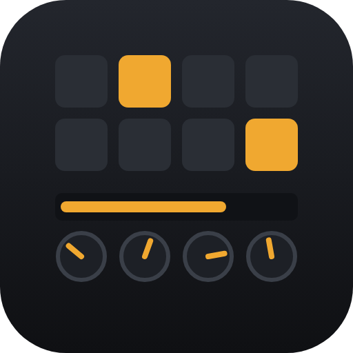
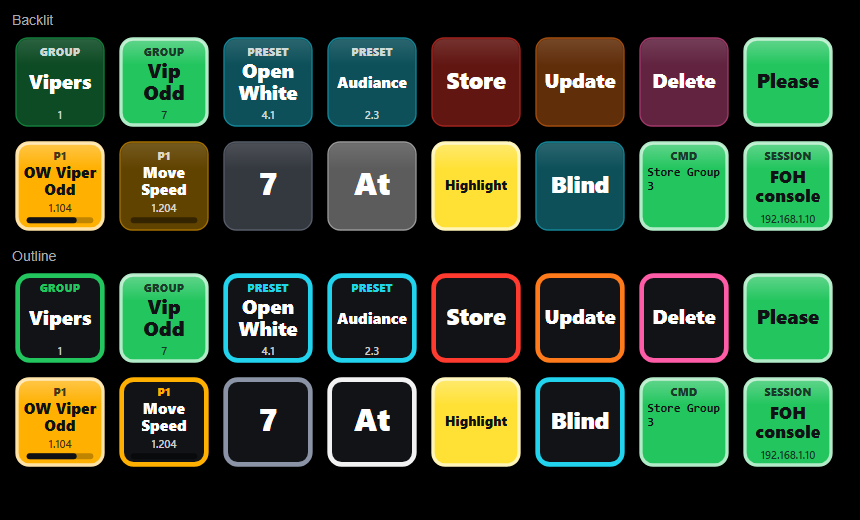

  

<h1 align="center">Open grandMA3 Deck</h1>

  <b>A free, open-source Stream Deck plugin that turns a Stream Deck XL, + or + XL into a grandMA3 command wing, encoder wing and executor extension.</b> 
  Plain OSC to grandMA3 onPC or a console. No Companion, no grandMA3 plugins, no licences.

  
  
  
  

  

## Why

grandMA3 onPC on a laptop is great until you need encoders and hard keys. Open grandMA3 Deck gives you:

- **Real encoders on the Stream Deck + / + XL dials.** Banks are built from **your patch**, and the dials can also change the Fade, Delay, Speed, Phase and Width layers, and MAtricks.
- **A command wing that works like the console.** Type *Store*, press a group, done. The Clear, Oops, Highlight and Blind keys all behave as expected.
- **Executors and pools with the names from your show.** Keys read "Vipers", "Open White" or "Move Speed", not numbers.
- **One-click switching** between local onPC, the show PC and the console.
- **Keys you can find in a hurry:** backlit colours by function, and active keys light up.

## Features

**Encoders (Stream Deck + and + XL)**
- Attribute encoders for the current selection, with banks and encoder pages built from the grandMA3 patch
- Encoder layers: Value, Fade, Delay, Speed, Phase, Width, Accel, Decel, Transition
- Coarse / fine / ultra resolution, press-and-turn for fine, acceleration and rate limiting
- Executor faders with level feedback, MAtricks dial, and command dials (selection, page, Go+/Go-, value template, custom)

**Command wing and executors (any Stream Deck)**
- About 90 MA hard keys, a command line display, and console-style Store / Update / Delete onto pool and executor keys
- Executor keys (Go+, Flash, Toggle, Swap… or your own commands) with names, running state and fader level from the show; pages
- Pool objects (groups, presets, sequences, macros, worlds…) with names from the show
- MAtricks keys, colour picker keys, and keys for grandMA3 windows and overlays (MAtricks, Phaser Editor, Selection, Store options, Masters…)
- Command / macro keys: press / release, toggle, or type into the command line

**Built for shows**
- Sessions: saved connections for each console or onPC, switched from a popup or a key
- Names and encoder banks read from the show with a single `Lua` command line; nothing is imported into your show
- Ready-made profiles for the Stream Deck XL, + and + XL, a group-based colour picker, and an 8 × 8 pre-programming helper for touch screens (Virtual Stream Deck) with folders
- 16-colour palette, backlit / outline styles, automatic text contrast
- No runtime dependencies. The settings UI works offline.

## Compatibility

| | |
|---|---|
| grandMA3 | onPC and consoles, developed and verified against **2.4.2.2**. Uses grandMA3 2.x syntax (e.g. selection MAtricks). |
| Stream Deck app | 7.1 or newer |
| Windows | 10 / 11. Developed and tested on Windows. |
| macOS | 13 Ventura or newer. The plugin has no platform-specific code and the manifest declares macOS, but it hasn't been tested on a Mac yet. [Reports welcome](https://github.com/Hano009/open-gma3-deck/issues). |
| Devices | Any Stream Deck for keys. Dials: Stream Deck + (4) and Stream Deck + XL (6). Profiles: XL, +, + XL. |

## Quick start

1. **Install:** download `org.open-gma3-deck.streamDeckPlugin` from the [latest release](https://github.com/Hano009/open-gma3-deck/releases/latest) and double-click it. Optionally, double-click a ready-made profile from the same release.
2. **Set up grandMA3:** in *Menu → In & Out → OSC*, add two lines: commands in on port 8000, feedback out on port 8001. Follow the guide for your setup:
   - [grandMA3 onPC on the same computer](docs/setup-local-onpc.md)
   - [grandMA3 onPC on another computer](docs/setup-remote-onpc.md)
   - [grandMA3 console](docs/setup-console.md)
3. **Connect:** in any action's settings, open *grandMA3 connection*, enter the IP, press **Send test command**, then **Sync names now**.

## Documentation

| Guide | |
|---|---|
| [Setup: onPC on this computer](docs/setup-local-onpc.md) | Loopback setup, and the onPC loopback bug workaround |
| [Setup: onPC on another computer](docs/setup-remote-onpc.md) | Network, firewalls |
| [Setup: console](docs/setup-console.md) | Console network, show-day tips |
| [Actions reference](docs/actions.md) | Every key and dial, and what each gesture does |
| [Sessions, names and banks](docs/sessions-and-names.md) | Switching consoles, names from the show, custom banks |
| [Key colours, styles and profiles](docs/keys-and-profiles.md) | The palette, styles and ready-made layouts |
| [Troubleshooting](docs/troubleshooting.md) | Symptoms and fixes |
| [Development](docs/development.md) | Building, project layout, the OSC / Lua protocol |

## Contributing

Bug reports, grandMA3 version reports, Mac testing and pull requests are very welcome. See [CONTRIBUTING.md](CONTRIBUTING.md).

## Licence and trademarks

[MIT](LICENSE) © 2026 Fredrik Fedoriw and contributors.

The plugin bundles the Elgato Stream Deck SDK, ws and zod (MIT) and tslib (0BSD). Their licences are included in the plugin as `bin/THIRD-PARTY-NOTICES.txt`, generated at build time. All other code, icons and images in this repository are original work under the MIT licence.

grandMA3 and MA Lighting are trademarks of MA Lighting Technology GmbH. Stream Deck and Elgato are trademarks of Corsair Memory, Inc. This is an independent project, not affiliated with, endorsed by or supported by MA Lighting or Elgato.
